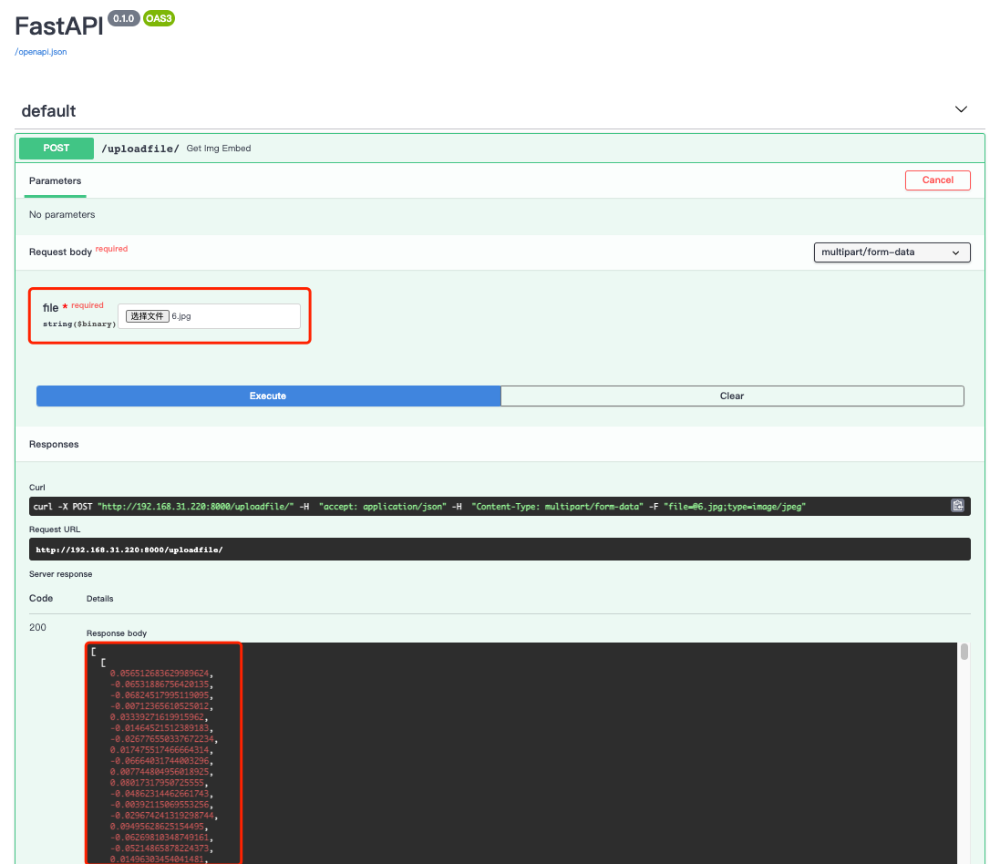

## 基于MTCNN和FaceNet的人脸识别

**如果本项目对你部署一个人脸识别的模型有帮助，欢迎Start...**

#### 环境安装

```bash
pip install -r requirements.txt
```

#### 本地Docker镜像打包

```bash
# 进入本项目根目录执行
docker build -t FaceRecognition:mtcnn+facenet .
```

#### 本地测试

```bash
# 命令行输入
uvicorn main:app --host 0.0.0.0
# 浏览器访问
http://127.0.0.1:8000/docs
```

#### 线上测试

```bash
docker pull mrzhang3389/face_recognition:mtcnn_facenet
# 运行
docker run -it -p 8000:8000 mrzhang3389/face_recognition:mtcnn_facenet
# 浏览器登陆
http://127.0.0.1:8000/docs
```

#### 浏览器测试如下：

传入一张含有人脸的图像, 输出一个列表包含图书每个人脸的512维数组特征.



#### 如何进行人脸识别

```python
import math
import json
import requests


def get_face_encoding(img_path):
    img_file = {'file': open(img_path, 'rb')}
    upload_data = {"accept": "application/json",
                   "Content-Type": "multipart/form-data"}
    upload_res = requests.post("http://192.168.31.220:8000/uploadfile", upload_data, files=img_file)
    encoding = json.loads(upload_res.content)
    return encoding


def euclidean_distance(A, B):
    '''用于计算两个列表中, 人脸特征之间的欧式距离.'''
    return math.sqrt(sum([(a - b) ** 2 for (a, b) in zip(A, B)]))


obama_1_encoding = get_face_encoding("assets/obama.jpg")
obama_2_encoding = get_face_encoding("assets/obama2.jpg")
biden_encoding = get_face_encoding("assets/biden.jpg")
print("obama_1 and obama_2:", euclidean_distance(obama_1_encoding[0], obama_2_encoding[0]))
print("obama_1 and biden  :", euclidean_distance(obama_1_encoding[0], biden_encoding[0]))
print("obama_2 and biden  :", euclidean_distance(obama_2_encoding[0], biden_encoding[0]))
```

#### 人脸识别比对结果


